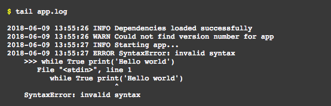
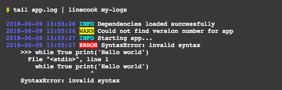

====================================================
linecook: Prepare lines of text for easy consumption
====================================================

.. default-role:: literal

.. image:: https://travis-ci.com/tonysyu/linecook.svg?branch=master
   :target: https://travis-ci.com/tonysyu/linecook

.. image:: https://codecov.io/gh/tonysyu/linecook/branch/master/graph/badge.svg
   :target: https://codecov.io/gh/tonysyu/linecook

.. image:: https://readthedocs.org/projects/linecook/badge/
   :target: https://linecook.readthedocs.io

See the documentation at https://linecook.readthedocs.io

`linecook` is a command-line tool that transforms lines of text into a form
that's pleasant to consume.

The core goal of `linecook` is to make it easy to create your own transforms to
parse whatever text you have. For example, take an `app.log` file that looks
like:

If you want to highlight the log type and mute the dates/times, then you can
create a custom recipe in one of your `configuration files
<https://linecook.readthedocs.io/en/latest/configuration.html>`_ like the
following:

.. code-block:: python

   from linecook import patterns as rx
   from linecook.transforms import color_text

   LINECOOK_CONFIG = {
       'recipes': {
           'my-logs': [
                color_text(rx.any_of(rx.date, rx.time), color='blue'),
                color_text('INFO', color='cyan'),
                color_text('WARN', color='grey', on_color='on_yellow'),
                color_text('ERROR', on_color='on_red'),
           ],
       },
   }

To use this recipe, you can just pipe the log output to `linecook` with your
new recipe as an argument:

That's all there is to it!
